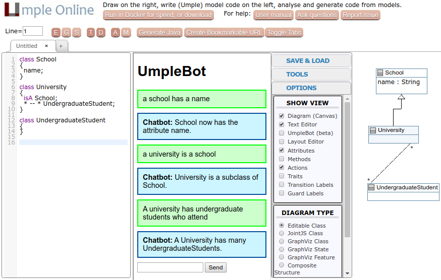

# Modeling Software Using Natural Language

Fall 2019
Younes Boubekeur, Anmoljeet Gill, Trung Vuong Thien

This project uses [Umple](http://umple.org/), developed at the University of Ottawa, as a modeling tool and API.

# Relevant course concepts

- Classification
- Part-of-Speech tagging and constituency detection
- Lexical and distributional semantics
- Context-Free Grammars
- Neural Networks and Long Short-Term Memory Networks
- Natural Language Generation
 

## Setup Instructions

Skip the first two instructions if you do not want to run the web application.

1. Clone this repo, and follow the steps [here](https://github.com/umple/Umple/wiki/SettingUpLocalUmpleOnlineWebServer), including doing the full build. It does take a few minutes to complete, but since we won't modify Umple itself this only needs to be done once.

2. In `build/`, run this command to build the UmpleOnline website:

    ```bash
    ant -DshouldPackageUmpleOnline=true -Dmyenv=local -f build.umple.xml packageUmpleonline
    ```

3. Install all Python dependencies using `pipenv install`.

4. Install the latest Stanford NLP server, and place the unzipped files, including the English model JARs, in `umpleonline/chatbot/stanford-corenlp-full-2018-10-05/`.

## Running the app

### Running the application backend
Open a terminal window and `./run_stanford_nlp`. Execute the tests in `test.py` using pytest or run `modeleval.py` to view the results of evaluating the three intent detection methods.

### Running the website
Open two more terminal windows. In the first, `./run_umple_online` and in the second, `./run_chatbot`.
Go to [localhost:8001/umple.php](http://localhost:8001/umple.php) using your browser and chat with the bot.

This is a preview of what the web application looks like if everything is running correctly:



